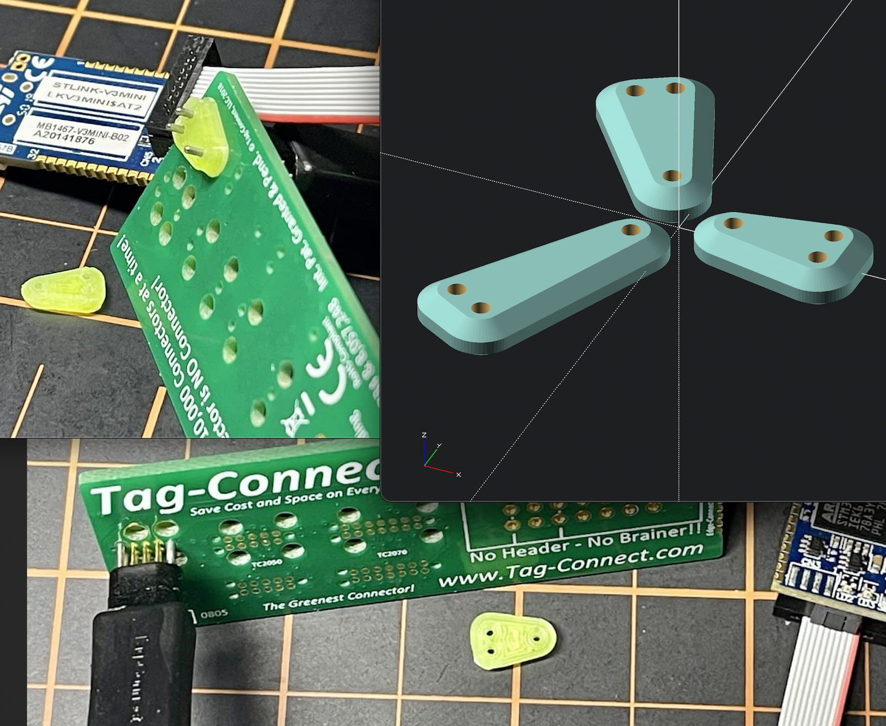

## Tag-Connect Cable Clip

Supported cables:
 - TC2030-CTX-NL 6-pin ARM Cortex Cable with 10-Pin Ribbon Connector (for FTSH-105)
 - TC2030-IDC-NL 6-Pin No-Legs Tag-Connect Cable with Ribbon Connector
 - TC2030-MCP-NL 6-Pin No-Legs Cable with RJ12 Modular Plug (for Microchip ICD)
 - TC2050-IDC-NL 10-Pin No-Legs Cable with Ribbon Connector.
 - TC2050-IDC-NL-430 10-Pin No Leg Cable for use with MSP430 / FET430
 - TC2070-IDC-NL 14-Pin No-Legs Cable with Ribbon Connector

You can find more info about Tag-Connect [here](https://www.tag-connect.com/technic)

### License

Licensed under either of

- Apache License, Version 2.0 ([LICENSE-APACHE](LICENSE-APACHE) or
  http://www.apache.org/licenses/LICENSE-2.0)
- MIT license ([LICENSE-MIT](LICENSE-MIT) or http://opensource.org/licenses/MIT)

at your option.

### Contribution

Unless you explicitly state otherwise, any contribution intentionally submitted
for inclusion in the work by you, as defined in the Apache-2.0 license, shall be
dual licensed as above, without any additional terms or conditions.
